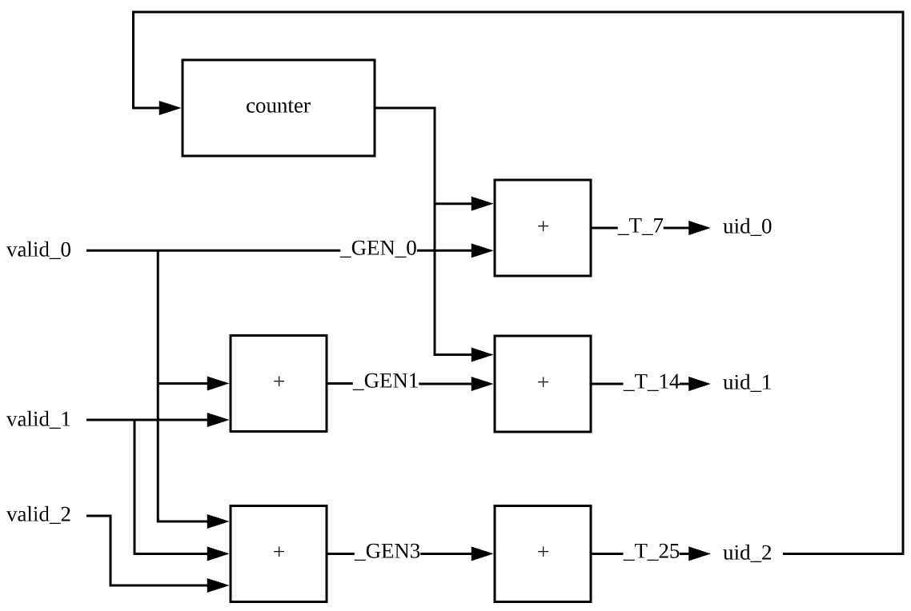

# PopCount

```
import chisel3.dontTouch
import freechips.rocketchip.util._

case class MyCoreParams(
  nWidth: Int = 3
)

class MyModule() extends Module {
  val io = IO(new Bundle{
    val a = Input(UInt(1.W))
    val b = Input(UInt(1.W))
    val d = Input(Bool())
    val c = Output(UInt(1.W))
  })
  io.c := io.a + io.b
  val mp = new MyCoreParams()
  // 4 x 1-bit registers
  val valid = Seq.fill(mp.nWidth)(RegInit(false.B))

  for (i <- 0 until mp.nWidth) {
    valid(i) := Mux(io.d, io.b, io.c)
  }

  // uid for each valid
  val counter = dontTouch(RegInit(0.U(128.W)))
  val uid = dontTouch(Wire(Vec(mp.nWidth, UInt(128.W))))
  for (i <- 0 until mp.nWidth) {
    val olderCnt = PopCount(valid.take(i+1).asUInt)
    uid(i) := counter + olderCnt
  }
  counter := uid(mp.nWidth-1)
}
```



```
module MyModule( // @[:freechips.rocketchip.system.DefaultConfig.fir@191550.2]
  input   clock, // @[:freechips.rocketchip.system.DefaultConfig.fir@191551.4]
  input   reset, // @[:freechips.rocketchip.system.DefaultConfig.fir@191552.4]
  output  io_c // @[:freechips.rocketchip.system.DefaultConfig.fir@191553.4]
);
  reg  valid_0; // @[ALU.scala 119:42:freechips.rocketchip.system.DefaultConfig.fir@191561.4]
  reg [31:0] _RAND_0;
  reg  valid_1; // @[ALU.scala 119:42:freechips.rocketchip.system.DefaultConfig.fir@191562.4]
  reg [31:0] _RAND_1;
  reg  valid_2; // @[ALU.scala 119:42:freechips.rocketchip.system.DefaultConfig.fir@191563.4]
  reg [31:0] _RAND_2;
  reg [127:0] counter; // @[ALU.scala 126:34:freechips.rocketchip.system.DefaultConfig.fir@191570.4]
  reg [127:0] _RAND_3;
  wire [127:0] _GEN_0; // @[ALU.scala 130:23:freechips.rocketchip.system.DefaultConfig.fir@191574.4]
  wire [127:0] _T_7; // @[ALU.scala 130:23:freechips.rocketchip.system.DefaultConfig.fir@191575.4]
  wire [1:0] _T_8; // @[Cat.scala 29:58:freechips.rocketchip.system.DefaultConfig.fir@191577.4]
  wire [1:0] _T_11; // @[Bitwise.scala 47:55:freechips.rocketchip.system.DefaultConfig.fir@191580.4]
  wire [127:0] _GEN_1; // @[ALU.scala 130:23:freechips.rocketchip.system.DefaultConfig.fir@191582.4]
  wire [127:0] _T_14; // @[ALU.scala 130:23:freechips.rocketchip.system.DefaultConfig.fir@191583.4]
  wire [2:0] _T_16; // @[Cat.scala 29:58:freechips.rocketchip.system.DefaultConfig.fir@191586.4]
  wire [1:0] _T_20; // @[Bitwise.scala 47:55:freechips.rocketchip.system.DefaultConfig.fir@191590.4]
  wire [1:0] _GEN_2; // @[Bitwise.scala 47:55:freechips.rocketchip.system.DefaultConfig.fir@191592.4]
  wire [2:0] _T_22; // @[Bitwise.scala 47:55:freechips.rocketchip.system.DefaultConfig.fir@191592.4]
  wire [127:0] _GEN_3; // @[ALU.scala 130:23:freechips.rocketchip.system.DefaultConfig.fir@191594.4]
  wire [127:0] _T_25; // @[ALU.scala 130:23:freechips.rocketchip.system.DefaultConfig.fir@191595.4]
  wire [127:0] uid_0; // @[ALU.scala 127:27:freechips.rocketchip.system.DefaultConfig.fir@191571.4 ALU.scala 130:12:freechips.rocketchip.system.DefaultConfig.fir@191576.4]
  wire [127:0] uid_1; // @[ALU.scala 127:27:freechips.rocketchip.system.DefaultConfig.fir@191571.4 ALU.scala 130:12:freechips.rocketchip.system.DefaultConfig.fir@191584.4]
  wire [127:0] uid_2; // @[ALU.scala 127:27:freechips.rocketchip.system.DefaultConfig.fir@191571.4 ALU.scala 130:12:freechips.rocketchip.system.DefaultConfig.fir@191596.4]
  assign _GEN_0 = {{127'd0}, valid_0}; // @[ALU.scala 130:23:freechips.rocketchip.system.DefaultConfig.fir@191574.4]
  assign _T_7 = counter + _GEN_0; // @[ALU.scala 130:23:freechips.rocketchip.system.DefaultConfig.fir@191575.4]
  assign _T_8 = {valid_1,valid_0}; // @[Cat.scala 29:58:freechips.rocketchip.system.DefaultConfig.fir@191577.4]
  assign _T_11 = _T_8[0] + _T_8[1]; // @[Bitwise.scala 47:55:freechips.rocketchip.system.DefaultConfig.fir@191580.4]
  assign _GEN_1 = {{126'd0}, _T_11}; // @[ALU.scala 130:23:freechips.rocketchip.system.DefaultConfig.fir@191582.4]
  assign _T_14 = counter + _GEN_1; // @[ALU.scala 130:23:freechips.rocketchip.system.DefaultConfig.fir@191583.4]
  assign _T_16 = {valid_2,valid_1,valid_0}; // @[Cat.scala 29:58:freechips.rocketchip.system.DefaultConfig.fir@191586.4]
  assign _T_20 = _T_16[1] + _T_16[2]; // @[Bitwise.scala 47:55:freechips.rocketchip.system.DefaultConfig.fir@191590.4]
  assign _GEN_2 = {{1'd0}, _T_16[0]}; // @[Bitwise.scala 47:55:freechips.rocketchip.system.DefaultConfig.fir@191592.4]
  assign _T_22 = _GEN_2 + _T_20; // @[Bitwise.scala 47:55:freechips.rocketchip.system.DefaultConfig.fir@191592.4]
  assign _GEN_3 = {{126'd0}, _T_22[1:0]}; // @[ALU.scala 130:23:freechips.rocketchip.system.DefaultConfig.fir@191594.4]
  assign _T_25 = counter + _GEN_3; // @[ALU.scala 130:23:freechips.rocketchip.system.DefaultConfig.fir@191595.4]
  assign uid_0 = _T_7; // @[ALU.scala 127:27:freechips.rocketchip.system.DefaultConfig.fir@191571.4 ALU.scala 130:12:freechips.rocketchip.system.DefaultConfig.fir@191576.4]
  assign uid_1 = _T_14; // @[ALU.scala 127:27:freechips.rocketchip.system.DefaultConfig.fir@191571.4 ALU.scala 130:12:freechips.rocketchip.system.DefaultConfig.fir@191584.4]
  assign uid_2 = _T_25; // @[ALU.scala 127:27:freechips.rocketchip.system.DefaultConfig.fir@191571.4 ALU.scala 130:12:freechips.rocketchip.system.DefaultConfig.fir@191596.4]
  assign io_c = 1'h0; // @[ALU.scala 116:8:freechips.rocketchip.system.DefaultConfig.fir@191560.4]
  always @(posedge clock) begin
    if (reset) begin
      valid_0 <= 1'h0;
    end else begin
      valid_0 <= io_c;
    end
    if (reset) begin
      valid_1 <= 1'h0;
    end else begin
      valid_1 <= io_c;
    end
    if (reset) begin
      valid_2 <= 1'h0;
    end else begin
      valid_2 <= io_c;
    end
    if (reset) begin
      counter <= 128'h0;
    end else begin
      counter <= uid_2;
    end
  end
endmodule
```
